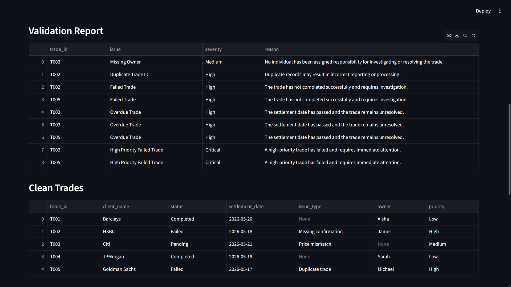

# Post Trade Automation Dashboard

## Overview

A Python-based automation tool that simulates post-trade operations workflows. The application processes trade data, identifies operational issues, calculates key performance indicators (KPIs), and presents insights through an interactive Streamlit dashboard.

The project also integrates a local Large Language Model (LLM) using Ollama and Llama 3.2 to generate AI-powered operational summaries and recommendations.

## Features

* Load and process trade data from CSV files
* Clean and standardise operational data
* Detect duplicate trades, failed trades, overdue trades, and missing ownership
* Generate validation reports
* Calculate operational KPIs
* Export reports to CSV and Excel
* Visualise data through a Streamlit dashboard
* Generate AI-powered operational summaries using Llama 3.2

## Dashboard Preview

### KPI Dashboard

### Validation Reporting

### AI Operational Summary

## Technologies Used

* Python
* Pandas
* Streamlit
* Plotly
* Ollama
* Llama 3.2
* OpenPyXL

## KPI Metrics

The dashboard tracks:

* Completion Rate
* Failure Rate
* Overdue Rate
* High Priority Failure Rate

## Validation Checks

The application automatically identifies:

* Duplicate Trade IDs
* Missing Owners
* Missing Settlement Dates
* Failed Trades
* Overdue Trades
* High Priority Failed Trades

## Running the Project

Install required libraries:

pip install -r requirements.txt

Run the data processing script:

python post_trade_automation.py

Launch the dashboard:

streamlit run app.py

## Example Outputs

* Validation Report
* KPI Summary
* Clean Trades Dataset
* AI Operational Summary