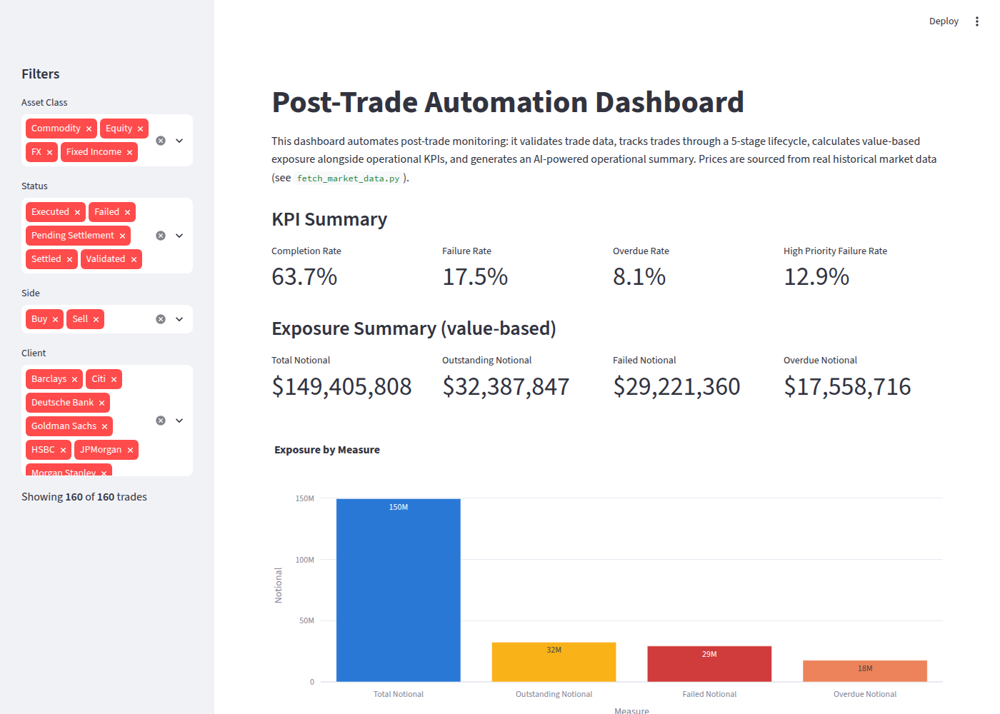
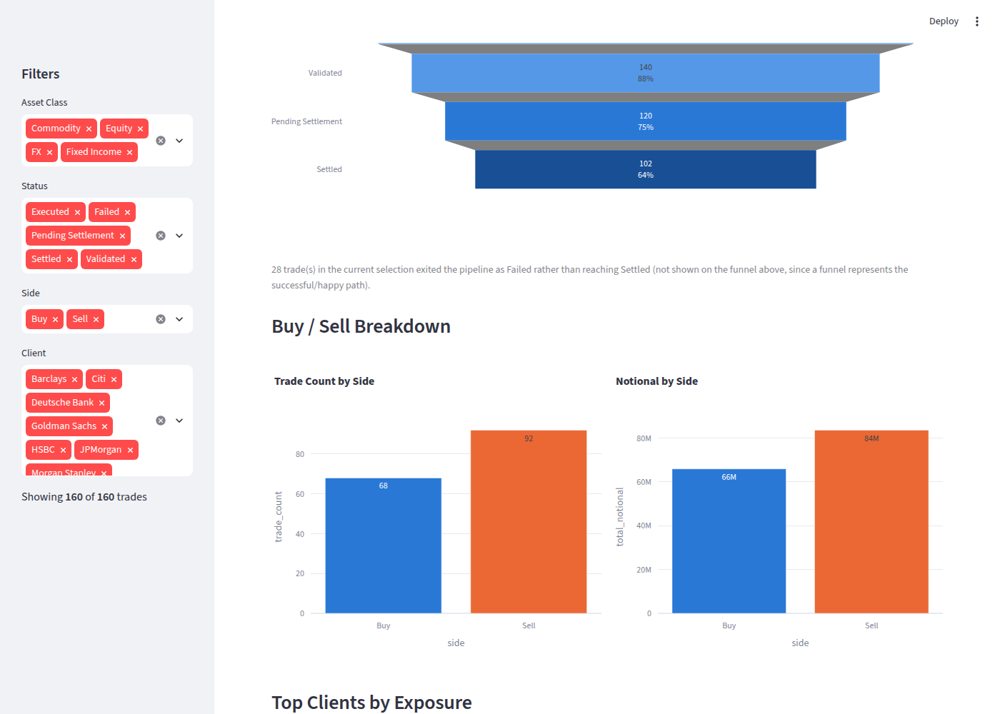
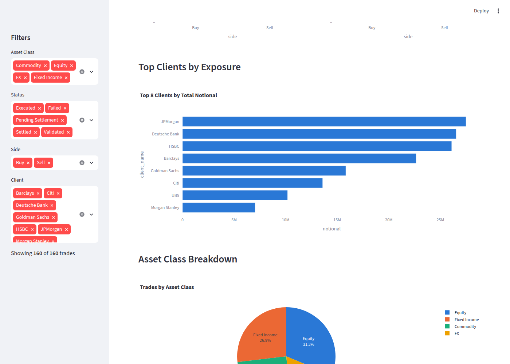
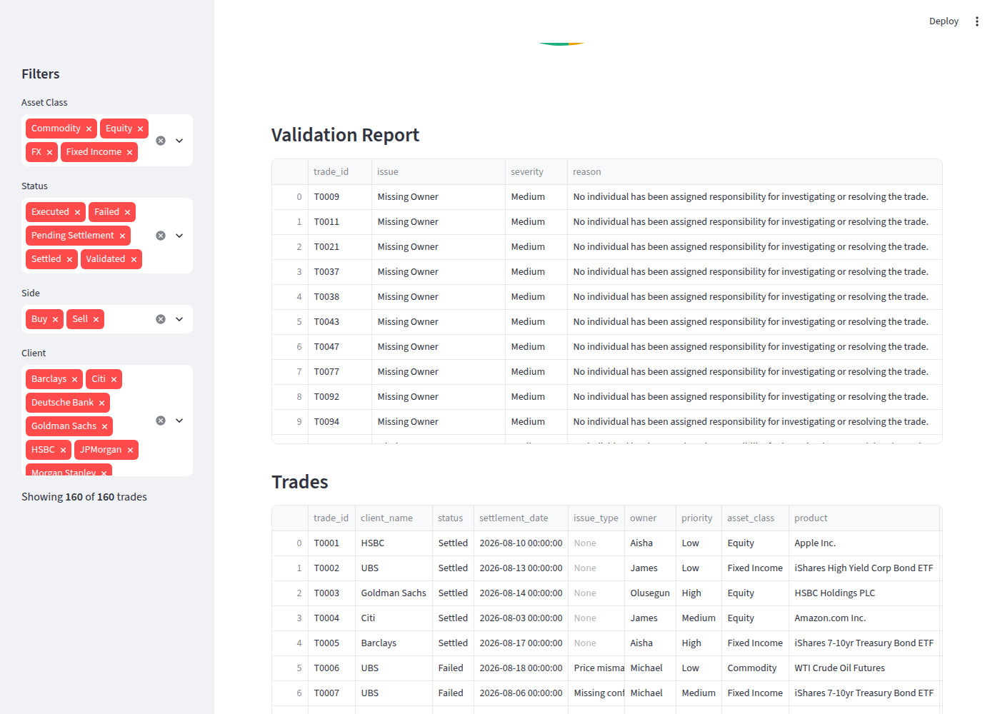
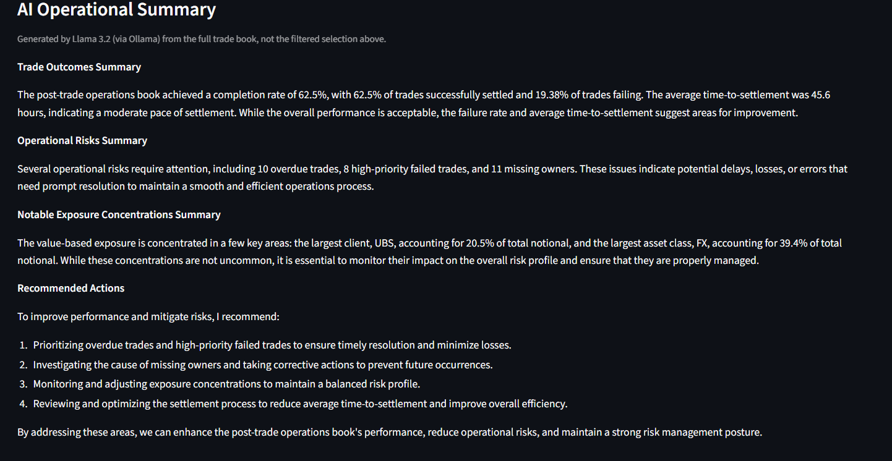

# Post-Trade Automation Dashboard

A Python application that models a simplified post-trade operations workflow: it simulates a trade blotter priced from **real historical market data**, tracks each trade through a 5-stage settlement lifecycle, runs automated validation and risk checks, calculates both count-based and value-based (notional) exposure metrics, and generates an AI-powered operational summary using a locally hosted LLM — all surfaced through an interactive Streamlit dashboard.

Built as a personal project to explore how quantitative analysis and technology are used to understand risk and inform decision-making in post-trade operations, ahead of a Goldman Sachs Women in Trading Academy application.

## Dashboard Preview

**KPI summary, exposure metrics and exposure chart**


**Trade lifecycle funnel and buy/sell breakdown**


**Top clients by exposure**


**Validation report and trade blotter**


**AI operational summary (generated locally by Llama 3.2 via Ollama)**


## Features

* **150+ simulated trades** across **4 asset classes** — Equity, Fixed Income, FX and Commodity — priced using **real historical market data** pulled from Yahoo Finance (via `yfinance`), not random numbers
* **5-stage trade lifecycle** — Executed → Validated → Pending Settlement → Settled / Failed — with real timestamps per stage, enabling settlement monitoring and an average time-to-settlement calculation
* **6 automated validation and risk checks** — duplicate trade IDs, missing owners, missing settlement dates, failed trades, overdue settlements, and high-priority failed trades — compiled into a single validation report
* **4 value-based exposure measures** — total, outstanding, failed and overdue notional — alongside the original count-based operational KPIs (completion / failure / overdue / high-priority failure rate), so trade-count risk and value-weighted risk can be compared side by side
* **Interactive Streamlit dashboard** with **4 filtering dimensions** (asset class, status, side, client), a value-based exposure chart, a buy/sell breakdown, a trade lifecycle funnel, and a top-clients-by-exposure view — all recalculated live as filters change
* **AI-generated operational summary** via a locally hosted **Llama 3.2** model (through Ollama), covering trade outcomes, operational risks, and notable exposure concentrations (e.g. which client or asset class the risk is concentrated in)

## How the data is built

Unlike a purely simulated blotter, trade prices in this project come from real market history:

1. `fetch_market_data.py` pulls historical daily closing prices from Yahoo Finance for a small basket of instruments per asset class (real stocks, FX pairs, commodity futures, and bond ETFs as a Fixed Income proxy — see Limitations below) and caches them to `Data/market_prices.csv`.
2. `generate_trades.py` builds the simulated trade blotter — client, owner, priority, status, lifecycle timestamps — but prices each trade using a real historical close from that cache (with a small random jitter to simulate execution vs. the closing print), and books it on a real recency-biased trading day.
3. `post_trade_automation.py` cleans the data, runs the validation checks, and calculates the KPIs, exposure measures, and average time-to-settlement.
4. `app.py` renders everything as an interactive dashboard.

If there's no internet connection available (e.g. running the project offline), the pipeline automatically falls back to simulated prices around realistic anchor values, so the project still runs end to end — this is logged clearly in the console output so it's never silently substituted.

## Technologies Used

* Python
* Pandas
* Streamlit
* Plotly
* yfinance (real historical market data)
* Ollama + Llama 3.2 (AI-generated operational summaries)
* OpenPyXL (Excel report exports)
* Git / GitHub

## Trade Lifecycle

```
Executed → Validated → Pending Settlement → Settled
                                          ↘ Failed
```

Each trade is timestamped as it reaches each stage it passes through (stored in `Data/lifecycle_events.csv`), which is what makes the average time-to-settlement calculation and the lifecycle funnel chart possible.

## Validation Checks

The application automatically identifies:

* Duplicate Trade IDs
* Missing Owners
* Missing Settlement Dates
* Failed Trades
* Overdue Trades (settlement date has passed, trade still in-flight)
* High-Priority Failed Trades

## KPIs & Exposure Measures

**Count-based KPIs:** Completion Rate, Failure Rate, Overdue Rate, High-Priority Failure Rate

**Value-based exposure measures:** Total Notional, Outstanding Notional, Failed Notional, Overdue Notional

Keeping both lets you compare *how many* trades have an issue against *how much value* is actually at risk — a handful of failed trades matters a lot more if they're worth millions than if they're worth a few thousand.

## Project Structure

```
post-trade-automation-dashboard/
├── fetch_market_data.py       # pulls & caches real historical prices from Yahoo Finance
├── generate_trades.py         # builds the simulated trade blotter + lifecycle events
├── post_trade_automation.py   # cleaning, validation, KPIs, exposure, AI summary
├── app.py                     # Streamlit dashboard
├── requirements.txt
├── Data/                      # generated - market prices, trades, lifecycle events
└── Reports/
    ├── CSV/                   # generated - clean trades, validation, KPI & exposure reports
    └── Excel/                 # generated - same reports as .xlsx
```

`Data/` and `Reports/` are generated by running the scripts below — they aren't committed to the repo, since they're fully reproducible (and would just go stale otherwise).

## Running the Project

```bash
pip install -r requirements.txt

python fetch_market_data.py        # one-off: caches real market prices (needs internet)
python generate_trades.py          # builds the simulated trade blotter
python post_trade_automation.py    # cleans, validates, calculates KPIs & exposure

streamlit run app.py               # launches the dashboard
```

The AI operational summary step requires [Ollama](https://ollama.com) running locally with the `llama3.2` model pulled (`ollama pull llama3.2`). If Ollama isn't available, `post_trade_automation.py` still completes and writes a fallback message instead of crashing.

## Limitations & Simplifications

This is a learning project built to demonstrate an understanding of post-trade workflows, data validation, and risk/exposure analysis — it simplifies several things a real institutional system would handle more rigorously:

* **Fixed Income pricing is proxied via bond ETFs** (e.g. TLT, IEF, LQD), not real per-bond OTC prices. Public, free historical pricing for individual bonds traded over the counter isn't generally available, so a liquid bond ETF's price is used as a stand-in for "what a fixed income instrument's price looks like."
* **Settlement is modelled as a flat T+2 convention** for every trade, regardless of asset class or market. In reality, settlement cycles vary — e.g. some markets have moved to T+1, and FX has its own conventions.
* **FX notional uses the dealt currency amount directly** rather than being derived from quantity × rate, which is closer to how FX trades are actually sized — every other asset class uses quantity × price.
* **Operational data (clients, owners, priorities, issue types, and which trades fail) is entirely simulated**, not drawn from any real desk. Only the *prices* are real; the trades themselves, and who's involved in them, are randomly generated for illustrative purposes.
* **No real settlement, custody, or regulatory reporting logic** (e.g. no modelling of standards like MiFID II or EMIR) — the validation checks are a simplified illustration of the kind of exception reporting a post-trade operations desk performs, not a production-grade compliance tool.
* **The AI operational summary depends on a local LLM.** If Ollama / Llama 3.2 isn't running, the dashboard still works, but that panel shows a fallback message rather than a generated summary.
* **If offline, prices fall back to a simulated random walk** around fixed anchor values rather than real historical data — the console output always makes clear which mode was used for a given run.

## Author

Precious Adagunodo — BSc Mathematics, University of Birmingham (Year 2)
